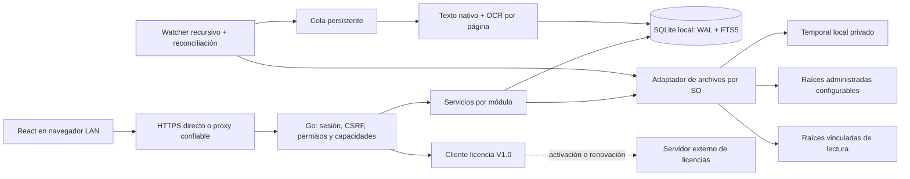

# AIBID — Arquitectura V1

Estado: H1 aprobada; H2–H5 implementadas, incluida revisión y materialización recuperable.
Requisitos en [alcance](docs/REQUIREMENTS.md), decisiones en [DECISIONS.md](DECISIONS.md)
y entrega ejecutable en [H5](docs/H5.md). No hay dependencia operativa de XAMPP,
PHP ni MySQL, aunque esta carpeta esté bajo `htdocs`. No servir esta carpeta fuente
como raíz pública de Apache; los instaladores entregarán binario y assets compilados.

## Componentes y límites

Un proceso Go supervisa HTTP, trabajos y vigilancia; los extractores PDF/Tesseract
son subprocesos acotados. Sin Redis, microservicios ni broker externo. React usa el
mismo origen `/api/v1`; assets compilados embebidos con `go:embed` en distribución.
Los procesos de desarrollo separados usan proxy del servidor frontend a loopback.

Los límites lógicos futuros dentro de `internal/` son `identity`, `authorization`,
`audit`, `libraries`, `storage`, `documents`, `cases`, `workflow`, `jobs`, `indexing`,
`search`, `licensing`, `operations` y `httpapi`. Crear cada uno con su hito. Los
servicios controlan transacciones; adaptadores SQLite/SO no deciden permisos.
SQL y FTS quedan localizados; no fingir portabilidad automática de FTS5 a MySQL.

## Modalidades y capacidades

| Modalidad | Función | Capacidades requeridas |
| --- | --- | --- |
| Vinculada | Explorar/indexar raíces existentes, sin copiar originales | `linked_libraries`; `ocr` solo para ejecutar OCR |
| Administrada | Cargas y materialización en destino configurado | `managed_libraries`; `expedientes` si se usan; `review_workflow` si se revisa |
| Híbrida | Ambas y asociación de documento existente sin copia | `linked_libraries` + `managed_libraries`; otras según operación |

No existe feature `hybrid`. `review_workflow` requiere `expedientes`; expedientes
que reciben cargas requieren `managed_libraries`. La pérdida de módulos no elimina
datos ni acceso autorizado a consulta/exportación. Modalidad es configuración; el
origen `linked`/`managed` de cada identidad física es inmutable.

Crear/convertir a híbrida y habilitar nuevas escrituras en esa modalidad exige
ambas capacidades. La matriz se aplica también al worker antes de publicar; perder
una capacidad pausa la escritura correspondiente y deja accesible lo existente.

Una biblioteca vinculada puede pasar a híbrida sin cambiar registros existentes.
Agregar raíz inicia un trabajo propio; las cargas y búsquedas de las demás raíces
siguen atendidas. Deshabilitar pausa vigilancia, retirar solicita una decisión
explícita sobre conservar o retirar del índice las referencias, nunca borra originales.
Otras reducciones de modalidad requieren un plan que preserve acceso; no hay cambio
destructivo implícito para resolver licencias o configuración.

## Modelo e invariantes

Una ubicación física no es un expediente ni una plantilla. `physical_files`
representa identidad, `physical_file_locations` rutas actuales/históricas y alias,
`documents` clasificación, `content_versions` contenido observado, `extraction_runs`
texto extraído y `extraction_pages` páginas. Un documento puede no estar clasificado.
La identidad no depende del SHA-256; dos ubicaciones independientes con bytes iguales
son duplicados informados, no un mismo archivo.

`storage_roots` es propietario único de un conjunto físico; las vistas lógicas
filtran ubicaciones en esa biblioteca. Ni vistas, ni asociaciones, ni consolidación
de raíz repiten OCR. El control de identidad global impide usar alias para acceder
desde otra biblioteca sin una reorganización autorizada.

Disponibilidad, integridad, aprobación y frescura OCR tienen ejes separados.
`linked` ausente conserva texto consultable y aprobación. `managed` alterado
externamente exige nueva decisión y deja de contar como aprobado válido. Ver
[estados](docs/STATES.md) y [esquema](SCHEMA.md).

## Trabajo asíncrono y publicación

Escritor DB único con prioridad para transacciones interactivas, pool de lectura
acotado y páginas/lotes limitados. Nunca mantener una transacción mientras se hace
OCR, se copia un PDF o se recorre un NAS. Propuesta inicial: un worker OCR y otro
para E/S, presupuestos configurables; cualquier cifra de rendimiento queda pendiente
de medición con corpus representativo.

Los trabajos persisten tipo, clave idempotente, recurso, versión objetivo, intentos,
disponibilidad, lease, heartbeat y error saneado. Un máximo de cinco intentos totales
por fallos transitorios, backoff con jitter; errores permanentes requieren acción.
Reintento manual crea nueva ejecución auditada enlazada a la anterior. Lease y
fencing token impiden que un worker vencido publique resultados de una versión vieja.
Un bloqueo lógico por archivo serializa OCR/verificación/materialización relevante.

OCR se ejecuta solo en páginas con texto nativo insuficiente; parámetros de evaluación
y versión de extractor se registran. Las páginas nuevas se preparan fuera del índice
activo. Una transacción comprueba versión objetivo y sustituye páginas publicadas,
FTS y puntero de última extracción completa. Fallo conserva texto previo y marca
desactualización. Esto permite reextraer sin perder resultados mientras se procesa.

## Auditoría y fallos

Toda mutación de negocio incluye evento y tareas derivadas en su transacción SQLite.
Accesos, descargas y búsquedas se registran también: consulta original exacta,
bibliotecas realmente autorizadas, filtros y número de documentos encontrados.
El log operativo no reemplaza la bitácora. Eventos repetidos de watcher se agrupan
en una observación de cambio persistente; cada usuario reconoce esa notificación
una vez. Búsqueda, visualización y descargas requieren auditoría disponible.

La aprobación managed es un protocolo recuperable DB/archivos, no una transacción
atómica distribuida. [Especificación de almacenamiento](docs/STORAGE_WATCHER.md)
define fallos antes/después de publicación. Los cambios de rutas/nombres afectan
solo materializaciones futuras; configuración versionada y ruta exacta histórica.

## Licencias y recuperación

Un evaluador local de JWS separa estado comercial y estado local. Se consulta en
cada operación protegida junto con sesión y permisos, también en workers. Caché
criptográfica por digest/revisión; recalcular tiempos y capacidades en cada acceso.
No se cachea autorización indefinidamente. Mientras H6 no exista, únicamente builds
de desarrollo tendrán un adaptador explícito; no distribuir un bypass productivo.

Consulta y respaldo siguen posibles al vencer/revocar. Sin activación/firma válida,
solo asistencia y recuperación/exportación administrativa autorizada. Los jobs de
escritura documental se pausan al perder capacidad; comprobaciones de integridad,
eventos, auth y respaldos continúan. La lectura puede escribir auditoría y sesiones:
«solo lectura» es del contenido documental, no un filesystem SQLite read-only.

El servidor externo recibe solo campos del [contrato V1.0](LICENSE_CONTRACT.md).
Una perpetua válida opera offline indefinidamente; el corte de versiones se aplica
al actualizador, no convierte el uso instalado en suscripción.

## Referencias técnicas consultadas

SQLite admite lectores concurrentes y un escritor; WAL no es almacenamiento remoto.
El diseño se basa en [WAL](https://www.sqlite.org/wal.html). FTS5 es una proyección
regenerable del texto publicado; ver [FTS5](https://www.sqlite.org/fts5.html).
La vigilancia por subdirectorio y sus límites de red se verificaron en la
[documentación de fsnotify](https://github.com/fsnotify/fsnotify).
El procedimiento de copia consistente usa la [API de backup SQLite](https://www.sqlite.org/backup.html).
Estas referencias no fijan por sí solas versiones ni sustituyen pruebas por SO.

## Implementación de organización H4

`internal/libraries` mantiene una transacción de autorización para cada mutación.
`settings.go`, `catalogs.go`, `cases.go` y `classification.go` implementan modalidad,
configuraciones versionadas, catálogos, plantillas inmutables, requerimientos
particulares y asociaciones. `uploads.go` recibe bytes fuera de raíces documentales
con un journal `receiving`, valida PDF y publica documento/versión/job en una sola
transacción. La cola existente extrae también temporales mediante handles privados.

El filtro autor/revisor se aplica antes de paginar, contar o recuperar texto de
cargas privadas. Una asociación linked cambia metadatos: conserva identidad,
ubicaciones, contenido y extracción. Las raíces managed se registran como destinos;
H5 utiliza esos destinos para publicar documentos mediante un diario recuperable.

La interfaz AIBID incluye Cargas, Expedientes, Catálogos y ajustes por biblioteca,
además del buscador con filtros documentales. Los assets SVG son locales y están
embebidos junto con React; no hay fuentes ni servicios de marca externos.

## Workflow y almacenamiento H5

`workflow.go` valida política, responsabilidad y revisión; `materialization.go`
planifica/publica/confirma/limpia con diario y fencing. La cola recupera operaciones
interrumpidas sin duplicar ubicaciones ni aprobaciones. La ruta queda fija desde
la solicitud y la aprobación solo se confirma tras verificar el destino.
`managed_integrity.go` examina ubicaciones registradas con reglas distintas del
escáner linked. El avance del expediente continúa derivándose de estados reales.
La retención elimina solo temporales vencidos rechazados/cancelados y conserva
su privacidad, texto e historial. [Protocolo y pruebas](docs/H5.md).
