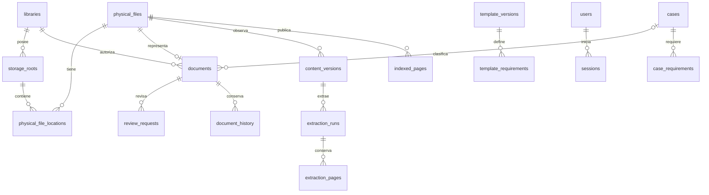

# AIBID — Modelo de datos

El [SQL de referencia](db/schema.proposed.sql) describe V1 completa para revisar
invariantes; **no es una migración inicial que cree todos los módulos**. H2 implementa
solo identidad/permisos globales/auditoría en `db/migrations/0001_identity.up.sql`,
con checksum y reversión protegida de DB vacía en `0001_identity.down.sql`.
Las tablas auxiliares `bootstrap_state` y `authentication_throttles` completan
el alta única y los límites persistentes. En H2 no se crearon tablas documentales. El SQL de referencia no se aplica a datos de cliente.

H3 agrega `0002_linked_libraries.up.sql`: bibliotecas/permisos, raíces/planes/vistas,
identidades y ubicaciones, versiones/extracciones/páginas, documentos vinculados,
FTS, cola/checkpoints, notificaciones y detalle sensible de búsquedas. La tabla
`documents` conserva su identidad al aplicar H4. [Entrega H3](docs/H3.md).

H4 agrega `0003_managed_organization.up.sql`: catálogos, plantillas/versiones,
expedientes/requerimientos, configuraciones versionadas y lotes/items de cargas.
Las columnas de clasificación se añaden sin reconstruir documentos, páginas ni FTS.
FK simples y triggers de clasificación comprueban biblioteca/categoría/tipo; el
servicio serializa la multiplicidad por expediente dentro de la transacción.
La inicialización copia una versión de plantilla una sola vez. `receiving` registra
una transferencia antes de publicar su documento; el localizador privado permanece
en `upload_items`. Reversión únicamente vacía. [Entrega H4](docs/H4.md).

H5 agrega `0004_document_workflow.up.sql`: `review_requests`, `materializations`
y `library_document_sequences`; columnas de versión/actor/fecha aprobada en
`documents` y `retain_until` en cargas. Una revisión pendiente por documento y
una materialización inicial por documento evitan duplicación. La operación fija
ruta, hash, tamaño, revisión documental y de configuración, raíz y decisión.
Se conservan todas las tablas/filas H4. [Entrega H5](docs/H5.md).

H6 agrega `0005_license_client.up.sql`: `license_installation` (identidad pública),
`license_state` (JWS actual y tiempos), `license_revision_floors` (máximo por
activación, hash y retiro), `license_artifacts` (solicitudes/respuestas trazables)
y `license_operations` (peticiones idempotentes preparadas/completadas/fallidas).
La clave privada permanece en un archivo protegido, no en SQLite. Los artefactos
no contienen la clave comercial. La reversión se niega después de crear identidad
o evidencia; los cambios previos se revierten en la misma transacción si otra
migración impide revertir. [Checksums y recuperación H6](docs/H6.md).

## Relaciones principales



## Diccionario y decisiones de persistencia

| Grupo | Tablas | Responsabilidad |
| --- | --- | --- |
| Identidad | `users`, `sessions`, `authentication_attempts` | Credenciales, sesión activa única e historial sin secretos |
| Autorización | `roles`, `role_permissions`, asignaciones globales/por biblioteca | Permisos explícitos, sin acceso documental implícito del administrador |
| Configuración | `libraries`, `library_configuration_versions`, `storage_root_configuration_versions` | Modalidad, destino futuro y revisiones inmutables de políticas/rutas |
| Disco | `storage_roots`, `root_operations`, `physical_files`, `physical_file_locations` | Raíces, planes/journal recuperables, identidad estable, alias e historial de rutas |
| Exploración | `logical_folder_views` | Prefijo filtrado; sin duplicar archivos/documentos |
| Contenido | `content_versions`, `extraction_runs`, `extraction_pages`, `indexed_pages`, `page_text_fts` | Hash/versiones observadas, texto por página y proyección activa |
| Organización | `categories`, `document_types`, `templates`, versiones/requisitos de plantilla | Catálogos genéricos por biblioteca |
| Expediente | `cases`, `case_requirements`, `documents` | Identificador visible, requerimientos propios y clasificación opcional |
| Flujo | `upload_batches`, `upload_items`, `review_requests`, `materializations` | Temporales privados, lotes, revisión y publicación recuperable |
| Procesamiento | `jobs`, `job_attempts`, `root_scans`, `scan_file_observations` | Lease, reintentos, progreso y barrera antes de declarar ausencias |
| Trazabilidad | `audit_events`, `search_audit_details`, `document_history`, notificaciones/acuses | Eventos persistentes, búsqueda exacta y avisos una vez por cambio/usuario |
| Operaciones | `idempotency_requests`, `backup_runs` | Reintentos HTTP y respaldo consistente |
| Licencia local | `license_installation`, `license_state`, `license_revision_floors`, `license_artifacts`, `license_operations` | Implementación H6; identidad pública, JWS, revisión máxima y trazabilidad; ningún servidor comercial |

UUID opacos para entidades; `INTEGER` interno solo en páginas FTS. No usar nombre,
contrato, hash o ruta como PK. Campos normalizados `*_key` se calculan en Go con
reglas explícitas; SQLite `NOCASE` no decide por sí solo Unicode ni case-folding de
un volumen. Instantes UTC con precisión fija para ordenar/comparar correctamente.
Validación RFC 3339, UUID, JSON con forma esperada y longitudes se hace en Go.

La ubicación principal se normaliza mediante `physical_files.primary_location_id`.
Desde allí se obtiene raíz, ruta relativa/canónica y revisión aplicable. Alias e
historial usan otras filas de `physical_file_locations`; tamaño, fechas del SO y
hash están en `content_versions`. No se guardan dos fuentes divergentes de esos
campos. La raíz anterior se conserva como histórica al consolidar o mover.

`os_identity_key` se llena solo con una identidad del SO validada, con volumen y
protección contra reutilización de identificadores. En recursos sin identidad
confiable queda NULL; no inventar la clave a partir de nombre/tamaño o hash.

## Invariantes de SQL y del servicio

| Invariante | SQL | Servicio Go necesario |
| --- | --- | --- |
| Una sesión abierta por usuario | Índice único parcial | Transacción login, expiración, comprobación en cada endpoint |
| Un documento por archivo, hasta un expediente | UNIQUE y FK simple `case_id` nullable | Reasignación con permiso, revisión optimista y auditoría |
| Biblioteca consistente | FK compuestas para archivos, documentos, catálogos, expedientes y raíces | Autorizar actor y validar permisos antes de consultas |
| Origen físico inmutable | CHECK + trigger | No cambiarlo al cambiar modalidad |
| Hash iguales permitidos | Índice no único | Avisar duplicado sin fusionar ni bloquear |
| Raíces sin solapamiento | Solo igualdad por `comparison_key` | Resolver SO, comparar componentes y serializar alta/consolidación |
| Ruta física única | Índice parcial ubicación vigente | Validar alias, identidad y carrera de apertura |
| Una revisión/trabajo activo | Índices parciales | Lease, fencing, estado documental y versión esperada |
| Bitácora append-only | Triggers contra UPDATE/DELETE | Custodia SO, retención excepcional y privilegios de mantenimiento |
| Temporal invisible | Tabla privada sin DTO público | Serializadores de lista permitida, autorización de preview y errores saneados |
| FTS coherente | Triggers de `indexed_pages` | Publicar extracción completa y puntero en una transacción |

El DDL permite insertar entidades por fases de una transacción; no constituye una
máquina de estados completa. Go debe validar: versión de contenido de la revisión
pertenece al archivo, destino de materialización es `managed`, configuración vigente
existe, aprobaciones no nulas corresponden a revisión válida, no editar versiones
históricas ni desincronizar texto de proyección, y cumplir políticas/licencia.
Estas invariantes serán pruebas de integración en su hito, no afirmaciones de H1.

## Sesión única: transacción prevista

1. Normalizar identificador y limitar intentos; verificar Argon2id fuera de la
   transacción usando hash real o hash ficticio equivalente para usuario inexistente.
2. Generar token aleatorio y token CSRF; conservar solo sus digests en DB.
3. En `BEGIN IMMEDIATE`, releer usuario, estado y `credential_version`. Si cambió
   desde verificar contraseña, rechazar y repetir autenticación con límites.
4. Cerrar sesión abierta (`new_login`; o `expired` si ya venció), insertar nueva
   sesión con versión actual, intento exitoso y eventos de auditoría; `COMMIT`.
5. Emitir cookie solo tras commit. Ante rollback sigue vigente la sesión anterior.

```sql
BEGIN IMMEDIATE;
-- Verificar usuario y credential_version esperado dentro de esta transacción.
UPDATE sessions SET closed_at = :now, close_reason = :reason
 WHERE user_id = :user_id AND closed_at IS NULL;
-- INSERT de la nueva sesión, intento y eventos, con parámetros ligados.
COMMIT;
```

Dos logins concurrentes se serializan: el último commit sustituye al anterior.
Cada request consulta sesión/usuario en DB; para mutaciones vuelve a comprobar en
la transacción de negocio. Cambiar/restablecer contraseña incrementa la versión y
cierra todas las sesiones en la misma transacción. Las cerradas permanecen para
identificar `SESSION_REPLACED` hasta su retención configurada; no JWT autónomo.

## Requerimientos y cumplimiento

Al crear expediente se copian requerimientos de la versión elegida de plantilla.
`requirements_initialized_at` más UNIQUE expediente/tipo hacen idempotente la
inicialización de legado; no sobrescribir cambios particulares al reintentar.
Cambiar plantilla crea nueva versión; los expedientes existentes no cambian.

Para cada tipo obligatorio `t`: `approved(t)` es el número real de documentos
no eliminados con aprobación válida; no hay columna editable de documentos recibidos.

```text
avance = 100 × Σ min(approved(t), required_count(t)) / Σ required_count(t)
```

Sin obligatorios, devolver `progress_percent: null` y «Sin requisitos obligatorios».
Los opcionales se muestran aparte; un archivo no cuenta en dos tipos. Mostrar
conteos reales por estado y excesos. Para tipos no múltiples, impedir segundo
documento activo y requerimiento >1 en la transacción del servicio; bajas lógicas
no bloquean una sustitución autorizada. Reasignación recalcula ambos expedientes.

`linked` aprobado ausente mantiene cumplimiento y muestra disponibilidad aparte.
`managed` alterado o ausente se excluye de aprobados válidos por integridad y/o
disponibilidad, sin borrar el evento de aprobación histórico. Restauración exige
verificar bytes aprobados o nueva revisión; no inventar que se aprobó la modificación.

## FTS y publicación de una nueva extracción

La búsqueda une FTS → `indexed_pages` → archivo → documento y bibliotecas permitidas
antes de calcular conteos, extractos o devolver rutas. FTS no decide permisos.
Una transacción elimina páginas publicadas del archivo, inserta páginas completas
de la extracción ganadora y cambia `indexed_extraction_id`. Triggers actualizan
FTS. Si falla/revierte, el texto anterior sigue íntegro. `missing` no borra páginas.
Eliminación manual del índice es lógica/auditada: quita publicación FTS y excluye
documento; conserva metadatos/historial según retención, nunca borra el original.

La normalización `unicode61 remove_diacritics 2` favorece búsquedas con/sin acentos.
Nombre e identificador exacto/con guiones usan filtros SQL parametrizados; no
interpretar toda entrada como sintaxis FTS. El compilador acepta términos/frases,
escapa literales y rechaza entrada mal formada con error estable. Los detalles de
[FTS5](https://www.sqlite.org/fts5.html) fundamentan la proyección y sus triggers.

## Retención y evolución

Bitácora general conserva identificadores históricos sin FK que cause cascadas.
El detalle sensible de búsqueda está separado pero forma parte del detalle del
evento; al vencer su retención un proceso autorizado lo purga y deja constancia.
Una rotación de auditoría general requiere mantenimiento exclusivo, exportación
verificada y evento de corte; no deshabilitar triggers desde una petición normal.
Es append-only frente a operaciones ordinarias, no frente al administrador del SO.

Migraciones con checksum, versión y backup previo. DDL `up`/`down` por módulo solo
cuando bajar sea seguro; una transformación con pérdida requiere restauración
verificada, no un `down` que borre evidencia. Probar actualización desde N-1.
