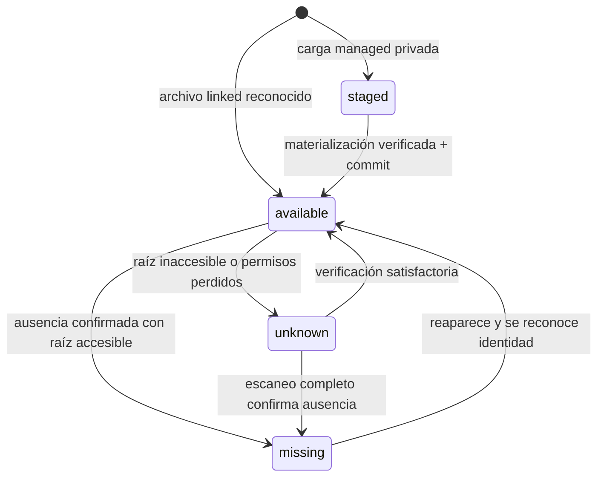
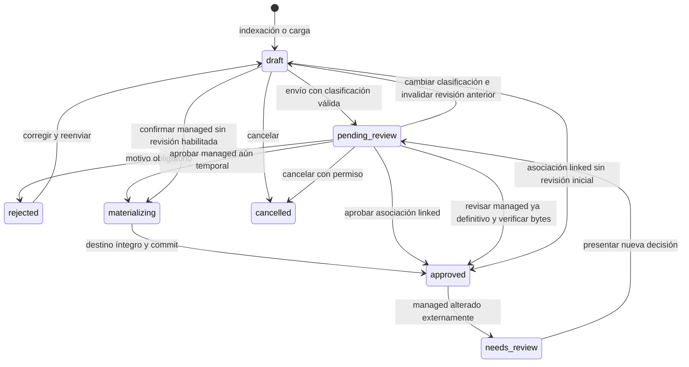
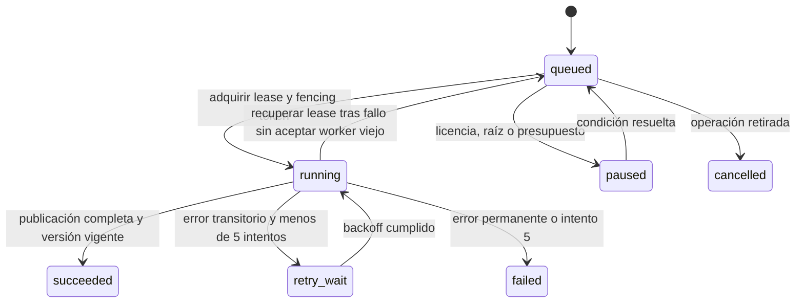
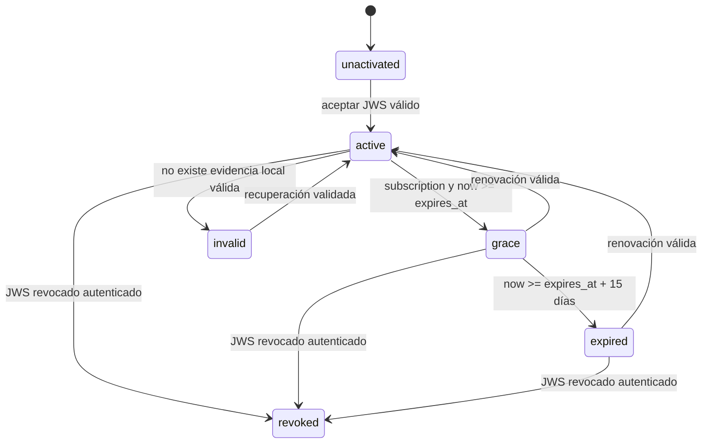

# Estados independientes

Una sola columna «estado» no representa disponibilidad, integridad, revisión y OCR.
Estos diagramas son contratos a implementar, no flujos disponibles todavía.

## Disponibilidad física e integridad

La inaccesibilidad de una raíz domina la disponibilidad **efectiva** de sus archivos:
se muestra `unknown` sin reescribir miles de filas ni declarar borrados. Si existe
otro alias autorizado, accesible y verificado, puede usarse. `integrity_status` es
`unknown`, `verified` o `changed`; una identidad managed aprobada con integridad
alterada nunca se presenta como su versión aprobada vigente.

| Suceso | Origen | Aprobación | Disponibilidad / cumplimiento |
| --- | --- | --- | --- |
| Modificación externa confirmada | linked | Se conserva | Nueva versión, aviso único, OCR anterior hasta reemplazo completo |
| Original desaparece | linked | Se conserva | No disponible; texto/FTS retenidos; cumplimiento separado |
| Modificación externa confirmada | managed | `needs_review` si aprobado | Alerta, no cuenta como aprobado válido, conserva historia |
| Archivo definitivo desaparece | managed | Evento previo se conserva | No disponible; no válido para cumplimiento hasta restaurar/verificar |
| NAS inaccesible | ambos | Sin cambio masivo | Estado efectivo desconocido; pausar/verificar |
| Cambio producido por materialización registrada | managed | Según operación | Correlación por operación+hash evita alarma externa falsa |

## Revisión documental

Fallo de copia deja `materializing` con operación fallida/reintentable; no se anuncia
aprobación final. Cancelar una materialización requiere reconciliar cualquier
publicación ya existente; se habilitará solo con ese protocolo completo. Edición
de clasificación durante revisión invalida esa solicitud (revisión optimista) y
requiere reenvío; nunca aprobar metadatos diferentes de los revisados.

Un linked asociado tiene revisión inicial si lo exige su biblioteca. Su siguiente
modificación externa no vuelve a `pending_review` ni `needs_review`. Si cambia
mientras se revisa inicialmente, el revisor debe confirmar qué versión observó.
Un indexed linked sin clasificación permanece `draft`; eso no impide buscarlo.
Baja lógica `deleted_at` es independiente; no borrar aprobación/auditoría histórica.

## OCR y cola

Recuperar lease consume/controla intentos; jamás reinicia automáticamente el máximo.
Un trabajo obsoleto termina sin publicar. Reintento manual es un job nuevo con
`retry_of_job_id`; requiere permiso y evento. Las ejecuciones de extracción son
`pending/running/complete/failed/superseded`. La frescura del texto publicado es
`none/current/stale`; «stale» sigue consultable.

## Licencia local

Una importación inválida se rechaza sin reemplazar un JWS válido existente. Un error
de red no produce `invalid`. Perpetua no transita por tiempo a `grace/expired`;
`maintenance_until` no vence el uso. Revocación offline solo se conoce al recibir
evidencia autenticada. `expired/revoked`: consulta, visualización, descarga y backup;
`invalid/unactivated`: recuperación administrativa, sin escrituras documentales.
